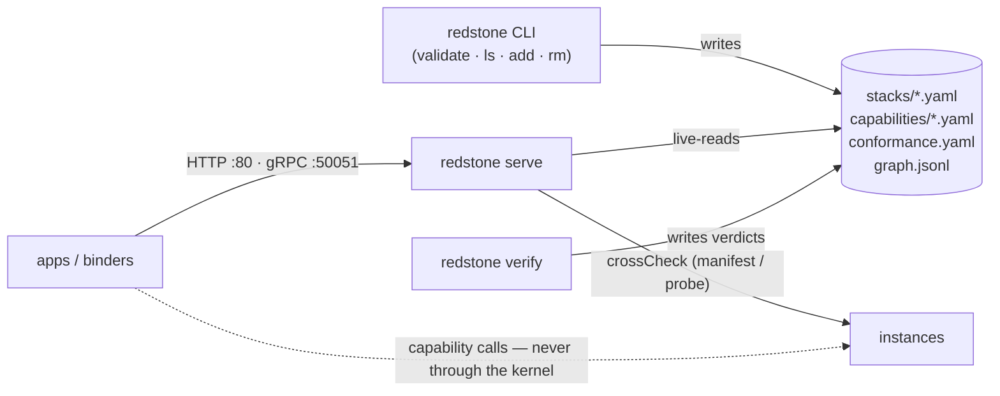

●━━━●━━⚡━━●━━━●

# Architecture

One static binary, no database, no daemon dependency. All state is files,
re-read on every request — edit a file, the next request sees it.

## State files

| File | Written by | Read by |
|---|---|---|
| `stacks/<name>.yaml` (or `<name>/stack.yaml`) | humans, `redstone add` | serve, verify, validate |
| `capabilities/<name>.yaml` | humans | serve (ladders), verify (packs) |
| `conformance.yaml` | `redstone verify` (atomic tmp+rename) | serve (enforced), `/svc/conformance/verdicts` |
| `graph.jsonl` | serve (append, mutex-serialized) | `/graph`, folded latest-wins per (stack\|consumer\|as) |
| `graph-archive.jsonl` | compaction (boot + >1 MiB) | you, for audit |

## The bind pipeline

Every bind — HTTP or gRPC, same function — runs:

1. **Alias** — `as` (the task), defaulting to the capability name.
2. **Declared use** — the stack file's entry for (app, task). Under
   `--strict`, a stacked bind with no declaration is refused here.
3. **Inherit / drift-check** — request may omit capability+level (inherited
   from the declaration); stated values must agree or the bind is refused
   naming both sides.
4. **Ladder check** — unknown level → refusal listing valid ones.
5. **Pick** — filter by capability, name-pin, labels; drop candidates whose
   *effective* level (verdict if one exists, else claim) ranks below the
   request; order self-stack first, then fleet (sorted file order).
6. **crossCheck** the winner: `check: manifest` (default) fetches
   `/manifest` and requires the capability to match (capability only —
   level is instance config; verify is the authority); `check: <path>` is a
   liveness probe; `check: none` / non-HTTP endpoints skip.
7. **Wire resolution** — each `wire` entry resolved recursively with the
   same machinery (max depth 3, cycles refused, optional wires may fail
   soft).
8. **Edge append** — stack, consumer, task, instance, verified, `with`,
   resolved `wire`, timestamp. Then the response.

Refusals aggregate *every* candidate's rejection reason — the 409 is the
product: a swap that would break is refused before any byte moves, in
writing.

## Two transports, one logic

| | HTTP `:80` | gRPC `:50051` |
|---|---|---|
| for | humans, curl, healthchecks, browsers | services, binders |
| refusal | `409` + refusal JSON | `FAILED_PRECONDITION`, details = same JSON |
| bad request | `400` | `INVALID_ARGUMENT` |

The kernel's own services are **core capabilities** with per-service bases
(`/svc/registry`, `/svc/graph`, `/svc/conformance`), each serving a
single-capability manifest — so the kernel sits in its own catalog and is
conformance-tested by its own verifier.

## Failure semantics

- Malformed YAML degrades to loud refusals, never wrong answers (parse
  error → instance absent → bind refused with reasons).
- Kernel down blocks *binds*, not traffic: apps bind at boot and hold
  endpoints; capability calls never pass through the kernel.
- Graph writes are mutex-serialized so an append can't race a compaction
  rename into a lost line.
- The kernel has **no auth by design** — run it network-internal; the
  perimeter is an ingress brick's job. The kernel never grows features.
